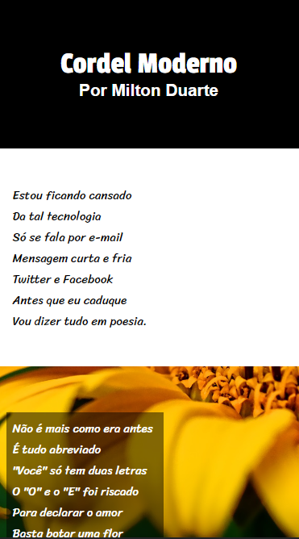

<h1 align="center">
  Projeto Cordel
</h1>

  <a href="#-tecnologias">Tecnologias</a>&nbsp;&nbsp;&nbsp;|&nbsp;&nbsp;&nbsp;
  <a href="#-projeto">Projeto</a>&nbsp;&nbsp;&nbsp;|&nbsp;&nbsp;&nbsp;
  <a href="#-link-do-projeto">Link do Projeto</a>&nbsp;&nbsp;&nbsp;|&nbsp;&nbsp;&nbsp;
  <a href="#-licença">Licença</a>

  

 

  

## ✨ Tecnologias

Esse projeto foi desenvolvido com as seguintes tecnologias:

- HTML
- CSS

## 💻 Projeto

Projeto de Site simples usando HTML e CSS com o Cordel Moderno de Milton Duarte, feito no curso de HTML e CSS do Cursoemvideo.

## 🚀 Link do Projeto

https://samuelsilvati.github.io/projeto-cordel

## 📄 Licença

Esse projeto está sob a licença MIT. Veja o arquivo [LICENSE](LICENSE) para mais detalhes.

---

Feito com ♥ by Samuel 👋🏻 [Veja outros projetos!](https://github.com/samuelsilvati?tab=repositories)
